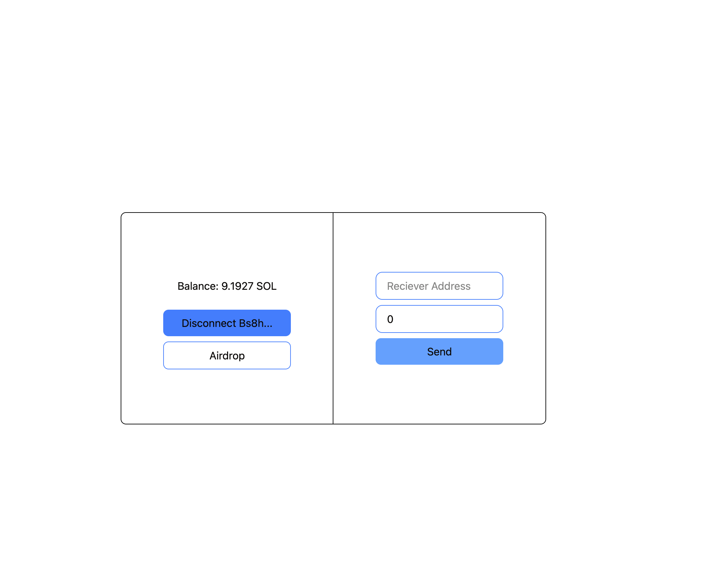
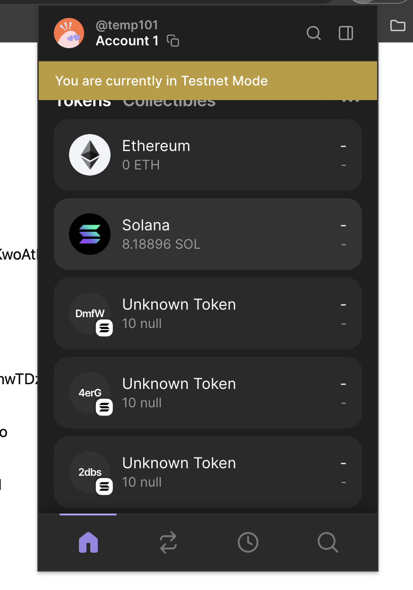
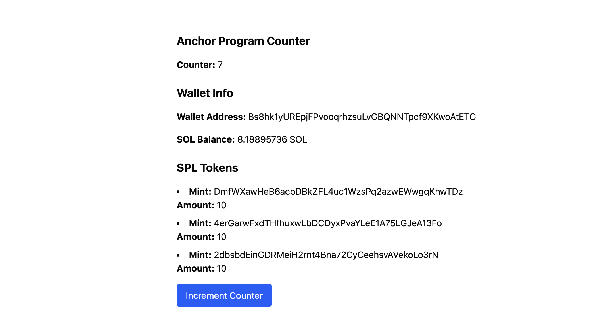
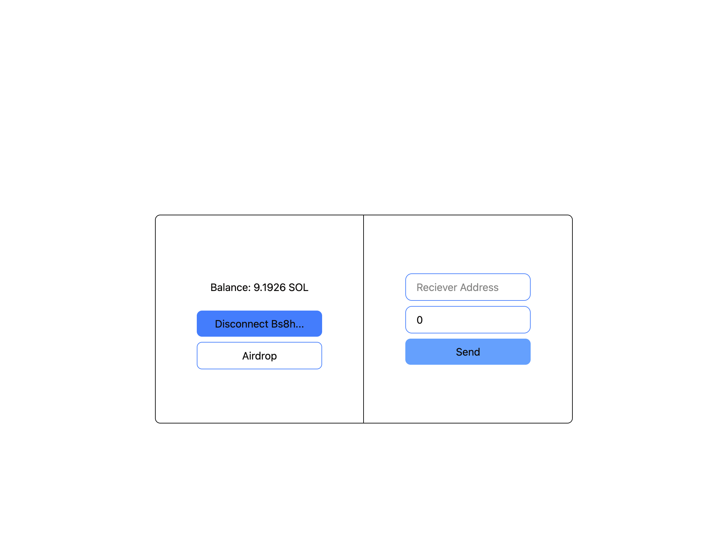
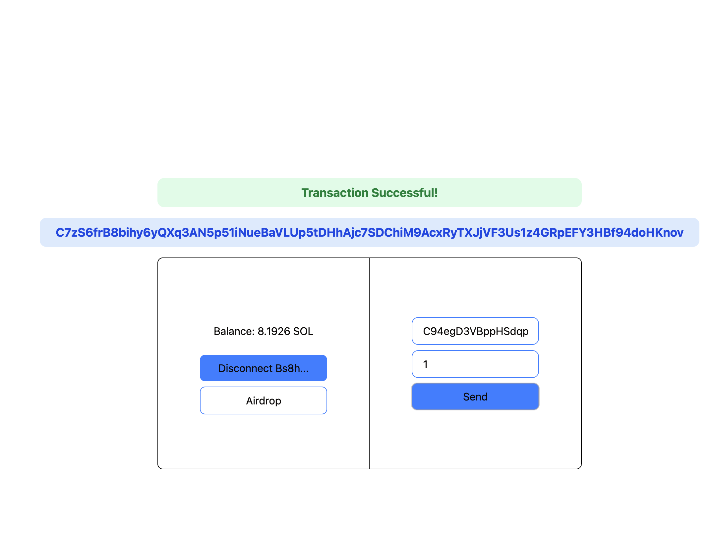

# Anchorpoint Beginner Assignment

## Wallet Connection

## Token Minting

Implemented token mint using the spl library

### Creating a Mint

### Tokens Visible in Wallet

## Reading Data from a Public Anchor Program

Used `@coral-xyz/anchor` to connect with a public anchor program using its IDL. Fetching and displaying global counter state from the chain.

### Writing to Anchor Program

Incrementing global counter state by 1 on each button click.

## Transaction States

The SOL in wallet before transaction is 9+.

### Sending SOL from a Wallet to Another

### After Transaction

After the transaction it's reduced to 8.something and displays the transaction signature.

# Anchorpoint Beginner Assignment

## Wallet Connection

## Token Minting

Token minting is the process of creating new tokens on the Solana blockchain. This involves creating a mint account and minting tokens to a wallet.

### Creating a Mint

### Tokens Visible in Wallet

## Reading Data from a Public Anchor Program

Used `@coral-xyz/anchor` to connect with a public anchor program using its IDL. Fetching and displaying global counter state from the chain.

### Writing to Anchor Program

Incrementing global counter state by 1 on each button click.

## Transaction States

The SOL in wallet before transaction is 9+.

### Sending SOL from a Wallet to Another

### After Transaction

After the transaction it's reduced to 8.something and displays the transaction signature.

### Creating a Mint

### Tokens Visible in Wallet

## Reading Data from a Public Anchor Program

Used `@coral-xyz/anchor` to connect with a public anchor program using its IDL. Fetching and displaying global counter state from the chain.

### Writing to Anchor Program

Incrementing global counter state by 1 on each button click.

## Transaction States

The SOL in wallet before transaction is 9+.

### Sending SOL from a Wallet to Another

### After Transaction

After the transaction it's reduced to 8.something and displays the transaction signature.

